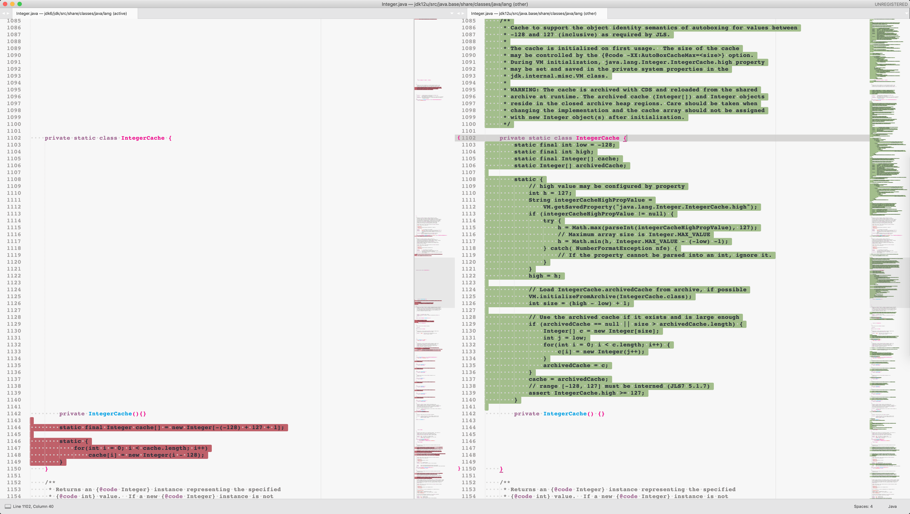

# Compare openjdk version of jdk6, jdk7u, jdk8u, jdk9u, jdk10u, jdk11u, jdk12u

> u is update

## Download JDK SourceCode

**Only Support MacOS Now**

```shell
sh -c "$(curl -fsSL https://raw.githubusercontent.com/lanlyhs/diffjdks/master/get.sh)"
```

## Compare

### Sublime Text

[Compare Side-By-Side](https://packagecontrol.io/packages/Compare%20Side-By-Side)



## From

[hg](http://hg.openjdk.java.net/)

## Thank You

[OpenJDK](http://openjdk.java.net/)
